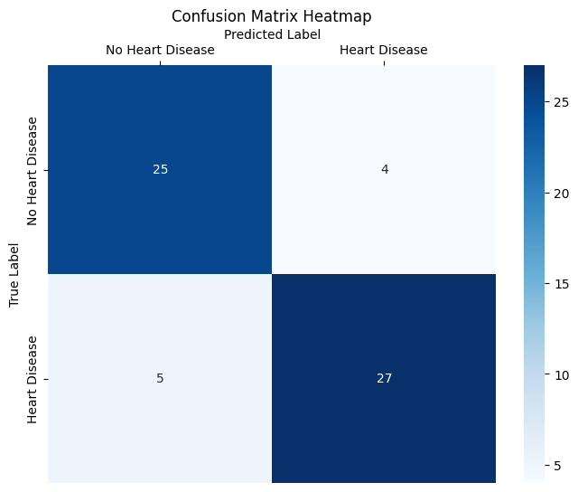
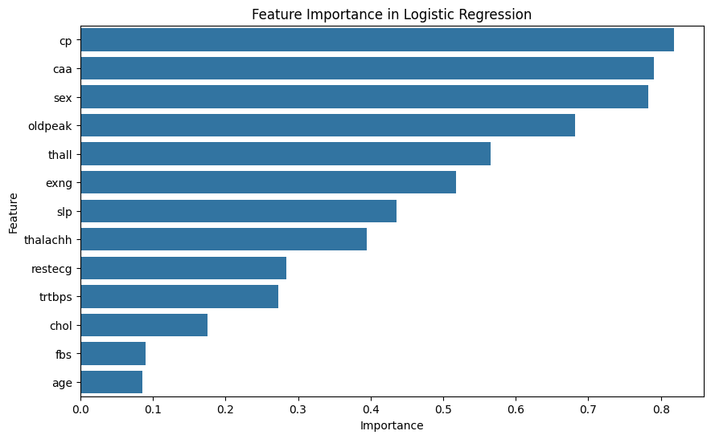
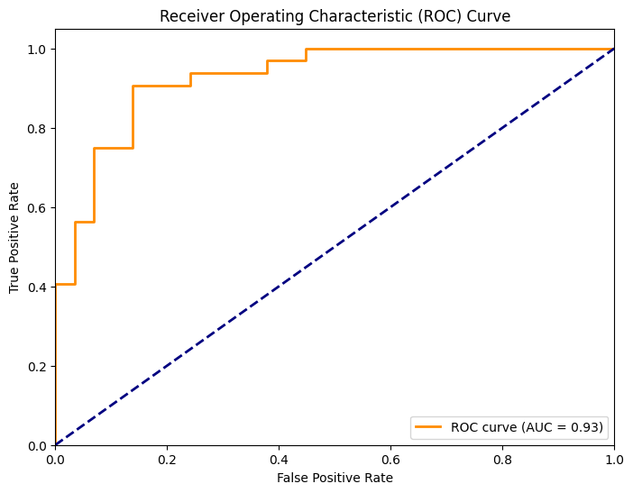

# Heart Attack Classification and Analysis    

This analysis utilizes Logistic Regression to predict heart attacks 🩺❤ and examine significant factors related to heart health. The model is able to predict heart attacks with an overall accuracy of 85%, trained on around 240 heart attack cases.

Key Metrics Summary:
Overall Accuracy: 85%
Precision (Heart Disease): 0.871
Recall (Heart Disease): 0.844
F1-Score (Heart Disease): 0.857 (1.0 is max and 100% accuracy, 0 is min)

 

## Chest pain, number of major vessels, and Sex: Highest impact on Heart Attacks.
 

## Receiver Operating Characteristic (ROC) curve

- AUC-ROC score quantifies the overall ability of the model to distinguish between classes:
  - AUC = 1.0: Perfect classifier. This model has an absolute difference of 0.07.
  - AUC = 0.5: No discrimination (random guessing).
  - AUC < 0.5: Worse than random guessing (the model is likely reversed in its predictions).

- True Positive Rate (TPR): Also known as sensitivity or recall, it measures the proportion of actual positives correctly predicted by the model.
  - TPR = True Positives (TP) / (True Positives (TP) + False Negatives (FN))

- False Positive Rate (FPR): It measures the proportion of actual negatives incorrectly predicted as positive.
  - FPR = False Positives (FP) / (False Positives (FP) + True Negatives (TN))

- The ROC curve plots TPR on the y-axis against FPR on the x-axis at various threshold values of the classification model.

---

This data is synthetic and should not be used for medical research; the purpose of this project is to study classification using logistic regression.

Source: https://www.kaggle.com/datasets/rashikrahmanpritom/heart-attack-analysis-prediction-dataset/data

[About the data](assets/heart_profile.html)

- **Age**: Age of the patient
- **Sex**: Sex of the patient
- **exang**: Exercise induced angina (1 = yes; 0 = no)
- **ca**: Number of major vessels (0-3)
- **cp**: Chest Pain type
    - Value 1: Typical angina
    - Value 2: Atypical angina
    - Value 3: Non-anginal pain
    - Value 4: Asymptomatic
- **trtbps**: Resting blood pressure (in mm Hg)
- **chol**: Cholesterol in mg/dl fetched via BMI sensor
- **fbs**: Fasting blood sugar > 120 mg/dl (1 = true; 0 = false)
- **rest_ecg**: Resting electrocardiographic results
    - Value 0: Normal
    - Value 1: Having ST-T wave abnormality (T wave inversions and/or ST elevation or depression of > 0.05 mV)
    - Value 2: Showing probable or definite left ventricular hypertrophy by Estes' criteria
- **thalach**: Maximum heart rate achieved
- **target**: 0 = less chance of heart attack; 1 = more chance of heart attack